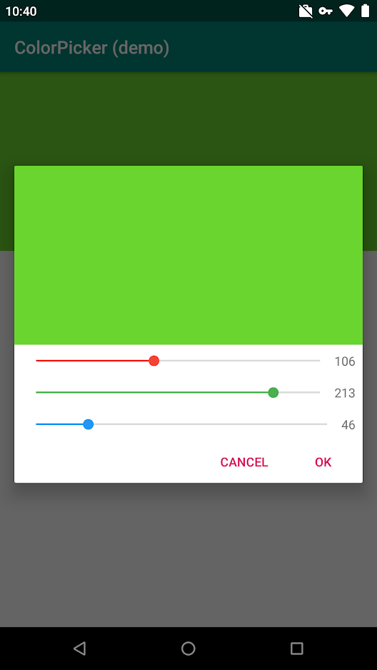

# Colour Picker Dialog
 

This library provides a simple material dialog for selecting an RGB colour.


## Screenshots


## Usage

1. Add jitpack to your root build.gradle

```
allprojects {
    repositories {
        ...
        maven { url 'https://jitpack.io' }
    }
}
```
2. Add this library as a dependency

```
dependencies {
    ...
    implementation 'com.github.djcass44:colorpickerdialog:-SNAPSHOT'
}
```

3. Implement the receiver

```
public class MainActivity extends AppCompatActivity implements IColorPickerReceivable {
    ...


    @Override
    public void onColorChosen(int color) {
        // use the selected colour here
    }
}
```

4. Create the dialog

```
Button buttonMain = findViewById(R.id.buttonMain);
buttonMain.setOnClickListener(view -> {
    ColorPickerDialog.Builder builder = new ColorPickerDialog.Builder(this, this)
            .setStartColour(lastColour),    // set the initial colour (default is white)
            .setTextPositive("Done"),       // set the text for the 'done' button (default is "OK")
            .setTextNegative("Cancel");     // set the text for the 'cancel' button (default is "Cancel")
    
    // build and show the dialog
    ColorPickerDialog dialog = builder.build();
    dialog.show();
});
```


## Contributing

Please open a pull request on the [gitlab repo](https://gitlab.com/django-android/colorpickerdialog) or send me a message!

## Note

The github repository is a mirror of the [gitlab repo](https://gitlab.com/django-android/colorpickerdialog)

## License

This project is licensed under the Apache License v2.0 - see the [LICENSE](LICENSE) file for details
